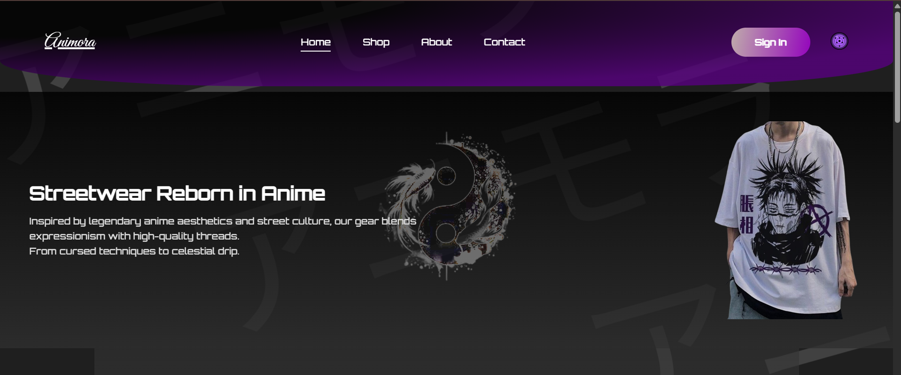
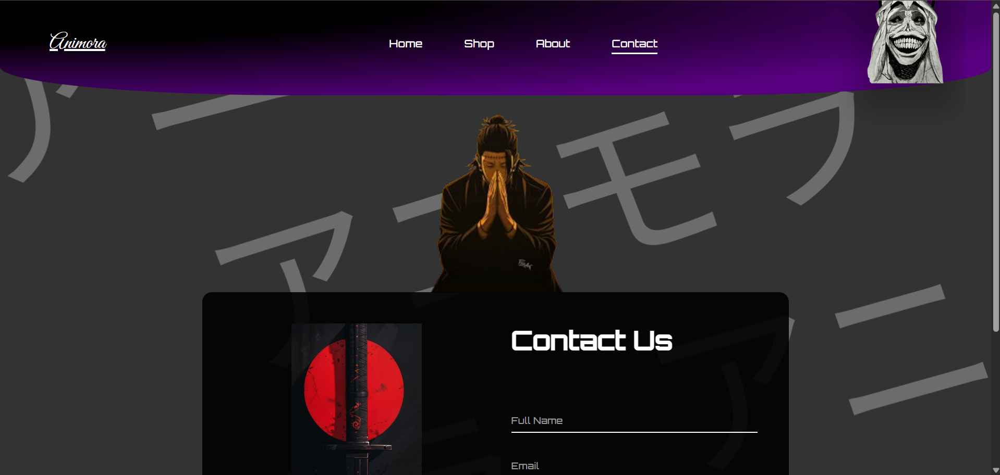
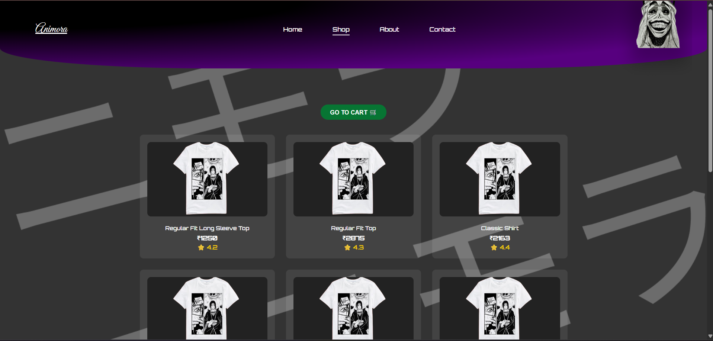
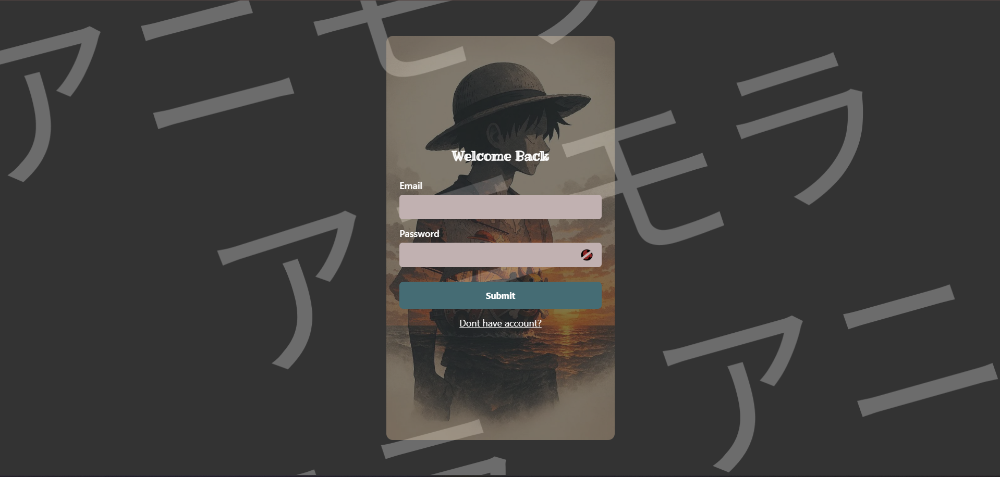
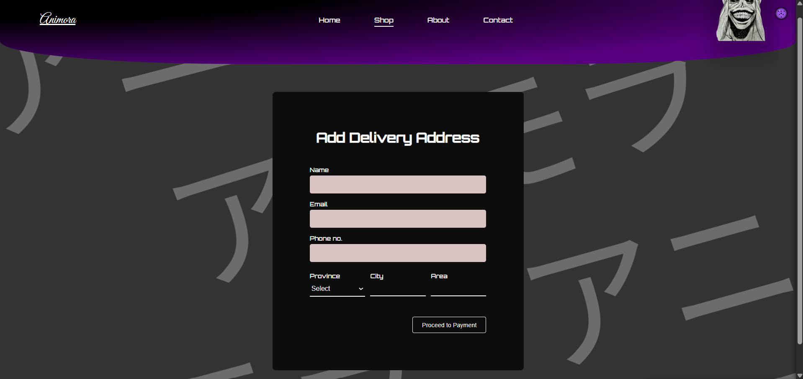
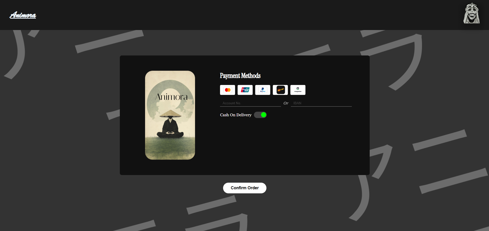
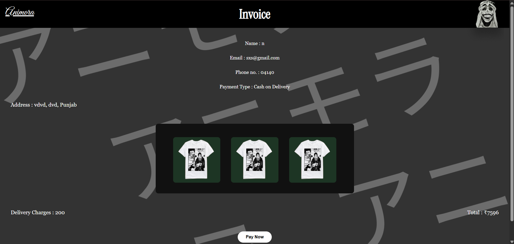

# Animora - Streetwear Reborn in Anime 👕🔥

Animora is a complete e-commerce platform dedicated to anime-themed streetwear. This project features a responsive design, interactive UI elements, and a modular structure built with pure web technologies.

---

## 📸 Project Showcase

Below are the visual highlights of the Animora platform:

### 🏠 Landing & Identity
- **Home Page:** 
- **About Us:** 
- **Contact:** 

### 🛍️ Shopping Experience
- **Main Shop:** 
- **Sign In:** 
- **Sign Up:** 

### 💳 Checkout & Logistics
- **Address Details:** 
- **Payment Options:** 
- **Order Placement Animation:** 
- **Order Invoice:** 

---

## 🛠️ Tech Stack
- **HTML5:** Semantic structure.
- **CSS3:** Custom styling and animations.
- **JavaScript:** Front-end logic and interactivity.
- **FontAwesome:** Scalable vector icons.

## 🚀 Installation & Usage
1. Clone the repository:
   ```bash
   git clone [https://github.com/MuqsitShafat/Animora-Wears-an-anime-Clothing-brand-website.git](https://github.com/MuqsitShafat/Animora-Wears-an-anime-Clothing-brand-website.git)